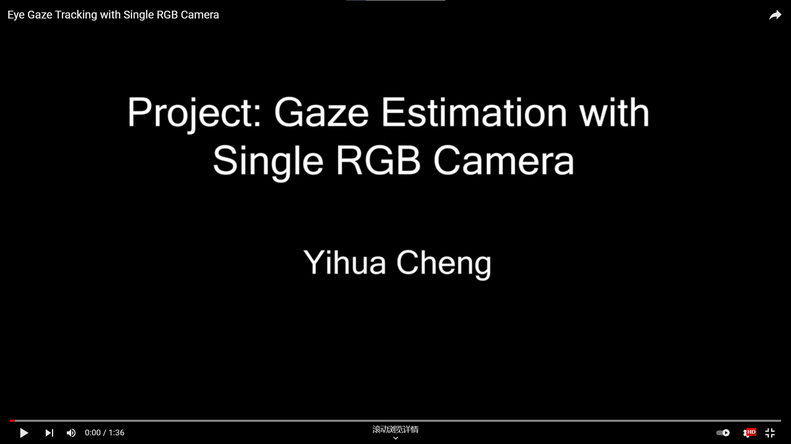

# GazeEstimation-Summary
## Description
  I will update this repository to summarize our works in gaze estimation.
  
  All **released codes**, **pre-trained models**, **data-preprocessing codes** will be updated in this page.
  
## Author-Yihua Cheng (程义华)
- Ph.D candidate of computer science at the Beihang University (Graduating Soon).
- B.S. degree of computer science from Beijing University of Posts and Telecommunications, 2017. 
- Any questions, please email me at yihua_c@buaa.edu.cn.

## Gaze Estimation Demo
[

](https://www.youtube.com/watch?v=e0rZ_B4ca7M)  

## Links of our works.

- [Puregaze: Purifying gaze feature for generalizable gaze estimation](https://github.com/yihuacheng/PureGaze), AAAI 2022.
- A Coarse-to-fine Adaptive Network for Appearance-based Gaze Estimation, AAAI 2020.
- Gaze estimation by exploring two-eye asymmetry, TIP 2020.
- [Appearance-Based Gaze Estimation via Evaluation-Guided Asymmetric Regression](https://github.com/yihuacheng/ARE-GazeEstimation), ECCV 2018.
- [Appearance-based Gaze Estimation With Deep Learning: A Review and Benchmark ](http://phi-ai.buaa.edu.cn/Gazehub/), Under Review.
- [Gaze Estimation using Transformer](https://github.com/yihuacheng/GazeTR), Under Review.

## Links of our implemented works.

- [Gaze360: Physically Unconstrained Gaze Estimation in the Wild](https://github.com/yihuacheng/Gaze360), ICCV 2019
- [Appearance-Based Gaze Estimation Using Dilated-Convolutions](https://github.com/yihuacheng/Dilated-Net), ACCV 2019
- [RT-GENE: Real-Time Eye Gaze Estimation in Natural Environments](https://github.com/yihuacheng/RT-Gene), ECCV 2018
- [MPIIGaze: Real-World Dataset and Deep Appearance-Based Gaze Estimation](https://github.com/yihuacheng/Gaze-Net), TPAMI 2017
- [It’s written all over your face: Full-face appearance-based gaze estimation](https://github.com/yihuacheng/Full-face), CVPRW 2017
- [Eye Tracking for Everyone](https://github.com/yihuacheng/Itracker), CVPR 2016
- [Appearance-Based Gaze Estimation in the Wild](https://github.com/yihuacheng/Mnist), CVPR 2015

## Data pre-processing code.
You can download data-processing code from [GazeHub](http://phi-ai.buaa.edu.cn/Gazehub/). 

All listed works use our codes for data processing.
- Puregaze: Purifying gaze feature for generalizable gaze estimation.
- Appearance-based Gaze Estimation With Deep Learning: A Review and Benchmark.
- Gaze Estimation using Transformer.
    
## Pre-trained model.

[**ResNet50-Version PureGaze, trained on ETH-XGaze:**](https://drive.google.com/file/d/1uLQ_1leNBUfwcWs796yTb_bdcUEnrJtK/view?usp=sharing).

## Updating
### UPDATE, 12.28-2021
- Add the video of demo.

### UPDATE, 12.07-2021
- Update link of PureGaze.
- Update pre-trained model of PureGaze.

### CREATE, 12.04-2021
- Create this repository.

